# Auto-Godot: Multi-Agent Game Generation Orchestrator

## Overview

Auto-Godot is an autonomous multi-agent system that generates complete video games for the Godot engine. Through an interactive interview process, the system collaborates with the user to flesh out a vague game idea into a detailed game specification, then decomposes it into fully-specified features. It manages dependencies and orchestrates specialized agents working in parallel git worktrees to build, test, and validate each feature until the game is complete.

## Goals

1. **Interview-Driven Design**: Collaborate with users through structured interviews to transform vague ideas into detailed game specifications
2. **Detailed Feature Specs**: Generate comprehensive feature specifications with clear acceptance criteria before implementation begins
3. **Autonomous Game Generation**: Transform specifications into playable Godot projects
4. **Feature-Driven Development**: Break complex requirements into discrete, testable features
5. **Parallel Execution**: Multiple agents work simultaneously on independent features using git worktrees
6. **Quality Assurance**: Automated tests and agent-driven manual testing ensure correctness
7. **Iterative Refinement**: Automatic retry and revision when features fail tests
8. **Transparent Progress**: Real-time UI for monitoring agents and managing prompts

---

## Architecture


---

## Agent Definitions

### 1. Interviewer Agent
**Purpose**: Collaborate with users to flesh out vague game ideas into detailed specifications

**Responsibilities**:
- Conduct structured interviews to understand the user's vision
- Ask clarifying questions about gameplay, mechanics, aesthetics, and scope
- Identify ambiguities and missing details in the game concept
- Generate a comprehensive Game Design Document (GDD)
- Produce detailed feature specifications with acceptance criteria
- Prioritize features based on user input (MVP vs. nice-to-have)

**Interview Flow**:
1. **Concept Discovery**: What kind of game? Genre, theme, inspiration
2. **Core Loop**: What does the player do moment-to-moment?
3. **Mechanics Deep-Dive**: How does each mechanic work in detail?
4. **Content Scope**: Levels, enemies, items, progression
5. **Technical Constraints**: Target platform, performance requirements
6. **Art Direction**: Visual style, perspective, aesthetic goals
7. **Audio**: Music style, sound effects, voice acting
8. **Polish & Feel**: Game feel, juice, accessibility

**Inputs**: Initial game idea from user, follow-up responses
**Outputs**: Game Design Document (GDD), detailed feature specifications

---

### 2. Planner Agent
**Purpose**: Decompose the detailed game specification into an implementation plan

**Responsibilities**:
- Analyze the Game Design Document from the Interviewer
- Break down into atomic, implementable features
- Establish dependency relationships between features
- Estimate complexity and suggest implementation order
- Generate the feature dependency graph
- Identify technical risks and suggest mitigations

**Inputs**: Game Design Document, feature specifications from Interviewer
**Outputs**: Feature dependency graph, implementation order

---

### 3. Supervisor Agent
**Purpose**: Coordinate feature implementation and manage the development lifecycle

**Responsibilities**:
- Monitor feature graph for ready-to-implement features (all dependencies satisfied)
- Assign features to available Coder agents
- Track progress across all active worktrees
- Handle failures by reassigning or escalating
- Merge completed features back to main branch
- Resolve merge conflicts (or escalate to user)
- Maintain overall project coherence

**Inputs**: Feature graph, agent status updates
**Outputs**: Agent assignments, merge operations, status reports

---

### 4. Coder Agent
**Purpose**: Implement individual features in isolated git worktrees

**Responsibilities**:
- Create Godot scenes, scripts, and resources
- Write GDScript or C# code following Godot best practices
- Implement game logic, UI, physics, AI as needed
- Create unit tests for the feature
- Self-review code before marking complete
- Document the feature implementation

**Inputs**: Feature specification, existing codebase context
**Outputs**: Git commits implementing the feature, test files

**Isolation**: Each Coder works in a dedicated git worktree to prevent conflicts

---

### 5. Tester Agent
**Purpose**: Validate features through automated testing at multiple levels

**Responsibilities**:
- Run unit tests (GUT or GdUnit4) for isolated logic verification
- Run integration tests with simulated input (GdUnit4 scene testing)
- Write new tests when coverage is insufficient
- Perform visual validation only for rendering/aesthetic criteria
- Report bugs with reproduction steps and failing test cases
- Verify acceptance criteria are met programmatically when possible

**Inputs**: Feature to test, acceptance criteria
**Outputs**: Test results, bug reports, pass/fail status

**Testing Philosophy**: Prefer deterministic, programmatic tests over visual/screenshot-based testing. Use the testing pyramid: many unit tests, fewer integration tests, minimal visual validation.

---

### 6. Reviewer Agent
**Purpose**: Quality gate before features are merged

**Responsibilities**:
- Review code changes for quality and consistency
- Check for common issues (memory leaks, performance problems)
- Verify Godot best practices are followed
- Ensure tests are sufficient
- Approve or request changes

**Inputs**: Git diff of feature branch
**Outputs**: Approval or change requests

---

## Data Model

### SQLite Schema

```sql
-- Game projects being developed
CREATE TABLE projects (
    id INTEGER PRIMARY KEY AUTOINCREMENT,
    name TEXT NOT NULL,
    description TEXT,
    godot_version TEXT DEFAULT '4.3',
    repo_path TEXT NOT NULL,
    created_at TIMESTAMP DEFAULT CURRENT_TIMESTAMP,
    updated_at TIMESTAMP DEFAULT CURRENT_TIMESTAMP
);

-- Interview sessions for fleshing out game concepts
CREATE TABLE interview_sessions (
    id INTEGER PRIMARY KEY AUTOINCREMENT,
    project_id INTEGER NOT NULL REFERENCES projects(id),
    initial_idea TEXT NOT NULL,
    status TEXT DEFAULT 'in_progress', -- in_progress, completed, abandoned
    created_at TIMESTAMP DEFAULT CURRENT_TIMESTAMP,
    completed_at TIMESTAMP
);

-- Individual Q&A exchanges within an interview
CREATE TABLE interview_exchanges (
    id INTEGER PRIMARY KEY AUTOINCREMENT,
    session_id INTEGER NOT NULL REFERENCES interview_sessions(id),
    question TEXT NOT NULL,
    answer TEXT,
    category TEXT, -- concept, mechanics, content, technical, art, audio, polish
    created_at TIMESTAMP DEFAULT CURRENT_TIMESTAMP
);

-- Game Design Document generated from interview
CREATE TABLE game_specs (
    id INTEGER PRIMARY KEY AUTOINCREMENT,
    project_id INTEGER NOT NULL REFERENCES projects(id),
    session_id INTEGER REFERENCES interview_sessions(id),
    title TEXT NOT NULL,
    genre TEXT,
    description TEXT NOT NULL,
    core_loop TEXT NOT NULL,
    target_audience TEXT,
    art_style TEXT,
    technical_requirements TEXT, -- JSON
    full_document TEXT NOT NULL, -- Complete GDD as markdown
    created_at TIMESTAMP DEFAULT CURRENT_TIMESTAMP,
    updated_at TIMESTAMP DEFAULT CURRENT_TIMESTAMP
);

-- Detailed feature specifications from interview
CREATE TABLE feature_specs (
    id INTEGER PRIMARY KEY AUTOINCREMENT,
    project_id INTEGER NOT NULL REFERENCES projects(id),
    game_spec_id INTEGER REFERENCES game_specs(id),
    name TEXT NOT NULL,
    description TEXT NOT NULL,
    detailed_requirements TEXT NOT NULL, -- Markdown with full details
    acceptance_criteria TEXT NOT NULL, -- JSON array of criteria
    priority TEXT DEFAULT 'mvp', -- mvp, important, nice_to_have
    category TEXT, -- core_mechanics, content, ui, audio, polish
    created_at TIMESTAMP DEFAULT CURRENT_TIMESTAMP
);

-- Raw prompts from users (legacy, for additional feature requests)
CREATE TABLE prompts (
    id INTEGER PRIMARY KEY AUTOINCREMENT,
    project_id INTEGER NOT NULL REFERENCES projects(id),
    content TEXT NOT NULL,
    status TEXT DEFAULT 'pending', -- pending, processing, completed, failed
    created_at TIMESTAMP DEFAULT CURRENT_TIMESTAMP,
    processed_at TIMESTAMP
);

-- Features derived from feature specs (implementation units)
CREATE TABLE features (
    id INTEGER PRIMARY KEY AUTOINCREMENT,
    project_id INTEGER NOT NULL REFERENCES projects(id),
    feature_spec_id INTEGER REFERENCES feature_specs(id),
    prompt_id INTEGER REFERENCES prompts(id), -- For ad-hoc feature requests
    name TEXT NOT NULL,
    description TEXT NOT NULL,
    acceptance_criteria TEXT, -- JSON array of criteria
    status TEXT DEFAULT 'pending',
    -- pending, in_progress, review, completed, failed
    priority INTEGER DEFAULT 0,
    complexity TEXT, -- simple, medium, complex
    branch_name TEXT,
    worktree_path TEXT,
    created_at TIMESTAMP DEFAULT CURRENT_TIMESTAMP,
    started_at TIMESTAMP,
    completed_at TIMESTAMP
);

-- Feature dependencies (DAG)
CREATE TABLE feature_dependencies (
    id INTEGER PRIMARY KEY AUTOINCREMENT,
    feature_id INTEGER NOT NULL REFERENCES features(id),
    depends_on_id INTEGER NOT NULL REFERENCES features(id),
    UNIQUE(feature_id, depends_on_id)
);

-- Agent execution runs
CREATE TABLE runs (
    id INTEGER PRIMARY KEY AUTOINCREMENT,
    feature_id INTEGER NOT NULL REFERENCES features(id),
    agent_type TEXT NOT NULL, -- planner, supervisor, coder, tester, reviewer
    status TEXT DEFAULT 'running', -- running, completed, failed
    started_at TIMESTAMP DEFAULT CURRENT_TIMESTAMP,
    completed_at TIMESTAMP,
    result TEXT, -- JSON with agent output
    error TEXT
);

-- Detailed logs for debugging
CREATE TABLE logs (
    id INTEGER PRIMARY KEY AUTOINCREMENT,
    run_id INTEGER REFERENCES runs(id),
    level TEXT NOT NULL, -- debug, info, warning, error
    message TEXT NOT NULL,
    metadata TEXT, -- JSON
    created_at TIMESTAMP DEFAULT CURRENT_TIMESTAMP
);

-- Test results
CREATE TABLE test_results (
    id INTEGER PRIMARY KEY AUTOINCREMENT,
    run_id INTEGER NOT NULL REFERENCES runs(id),
    feature_id INTEGER NOT NULL REFERENCES features(id),
    test_type TEXT NOT NULL, -- unit, integration, visual
    test_name TEXT,
    passed BOOLEAN NOT NULL,
    details TEXT, -- JSON with test output
    failure_message TEXT,
    screenshots TEXT, -- JSON array of screenshot paths (visual tests only)
    created_at TIMESTAMP DEFAULT CURRENT_TIMESTAMP
);
```

---

## Feature Lifecycle


**State Transitions**:

1. **PENDING → IN_PROGRESS**: Agent assigned, worktree created (only when all dependencies are COMPLETED)
2. **IN_PROGRESS → REVIEW**: Implementation complete AND all tests pass
3. **REVIEW → COMPLETED**: Reviewer approves, merged to main
4. **REVIEW → IN_PROGRESS**: Reviewer requests changes
5. **Any → FAILED**: Unrecoverable error (timeout, infrastructure failure, max iterations exceeded)
6. **FAILED → PENDING**: Manual retry or automatic retry with backoff

### Code-Test Loop (within IN_PROGRESS)

Testing is not a separate state—it's a continuous loop within IN_PROGRESS:


```python
async def implement_feature(feature: Feature, worktree: Path):
    """
    Code-test loop continues until tests pass or max iterations reached.
    """
    max_iterations = config.max_code_test_iterations  # e.g., 10

    for iteration in range(max_iterations):
        # Coder implements/fixes
        if iteration == 0:
            await coder_agent.implement(feature, worktree)
        else:
            await coder_agent.fix(feature, worktree, test_result.failures)

        # Tester validates
        test_result = await tester_agent.test(feature, worktree)

        if test_result.passed:
            # Move to review
            feature.status = "review"
            await db.update_feature(feature)
            return

        # Log iteration and continue
        await log_info(f"Feature {feature.id} iteration {iteration + 1}: {len(test_result.failures)} tests failed")

    # Max iterations exceeded - mark as failed
    feature.status = "failed"
    feature.error = f"Max iterations ({max_iterations}) exceeded"
    await db.update_feature(feature)
```

### Ready Features (Calculated)

"Ready" is not a persisted state—it's a **query filter** on PENDING features:

```python
def get_ready_features(project_id: int) -> List[Feature]:
    """
    A feature is ready when:
    1. Status is PENDING
    2. All dependencies have status COMPLETED
    """
    return db.query("""
        SELECT f.* FROM features f
        WHERE f.project_id = :project_id
        AND f.status = 'pending'
        AND NOT EXISTS (
            SELECT 1 FROM feature_dependencies fd
            JOIN features dep ON fd.depends_on_id = dep.id
            WHERE fd.feature_id = f.id
            AND dep.status != 'completed'
        )
        ORDER BY f.priority DESC, f.id ASC
    """, {"project_id": project_id})
```

This ensures ready status is always accurate—when a feature completes, its dependents become ready automatically without cascading updates.

---

## Git Worktree Strategy

Each feature is implemented in an isolated git worktree to enable parallel development:

```
project/
├── .git/                    # Main repository
├── main/                    # Main worktree (stable code)
├── .worktrees/              # Feature worktrees
│   ├── feature-player-movement/
│   ├── feature-inventory-system/
│   └── feature-enemy-ai/
└── .auto-godot/             # Orchestrator data
    ├── features.db
    ├── logs/
    └── screenshots/
```

**Workflow**:
1. Create branch: `git branch feature/<name>`
2. Create worktree: `git worktree add .worktrees/feature-<name> feature/<name>`
3. Agent works in worktree directory
4. On completion: merge to main, remove worktree
5. On failure: preserve worktree for debugging or retry

---

## Execution Pipeline

### Phase 1: Interview & Specification
```python
async def conduct_interview(initial_idea: str) -> GameSpec:
    """
    Interactive interview process to flesh out the game concept.
    Returns a detailed game specification and feature list.
    """
    # Start interview session
    session = InterviewSession(initial_idea)

    while not session.is_complete:
        # Interviewer generates questions based on current state
        questions = await interviewer_agent.generate_questions(session)

        # Present questions to user and collect responses
        responses = await ui.ask_user(questions)

        # Update session with responses
        session.add_responses(responses)

        # Check if we have enough detail
        session.is_complete = await interviewer_agent.check_completeness(session)

    # Generate final specifications
    game_spec = await interviewer_agent.generate_game_spec(session)
    feature_specs = await interviewer_agent.generate_feature_specs(session)

    # Store in database
    db.insert_game_spec(game_spec)
    for spec in feature_specs:
        db.insert_feature_spec(spec)

    return game_spec, feature_specs
```

### Phase 2: Planning & Decomposition
```python
async def plan_implementation(game_spec: GameSpec, feature_specs: List[FeatureSpec]) -> List[Feature]:
    # Planner analyzes specs and creates implementation plan
    features = await planner_agent.create_implementation_plan(game_spec, feature_specs)

    # Store features in database
    for feature in features:
        db.insert_feature(feature)

    # Build dependency graph
    graph = build_dependency_graph(features)

    return features
```

### Phase 3: Feature Scheduling
```python
async def schedule_features():
    while has_pending_features():
        # Find features with all dependencies satisfied
        ready_features = db.get_ready_features()

        for feature in ready_features:
            if agent_pool.has_available_coder():
                await assign_to_coder(feature)
```

### Phase 4: Feature Implementation
```python
async def implement_feature(feature: Feature):
    # Create isolated worktree
    worktree = await create_worktree(feature)

    try:
        # Coder implements the feature
        await coder_agent.implement(feature, worktree)

        # Tester validates
        test_result = await tester_agent.test(feature, worktree)

        if not test_result.passed:
            raise TestFailure(test_result)

        # Reviewer approves
        review = await reviewer_agent.review(feature, worktree)

        if not review.approved:
            raise ReviewRejected(review)

        # Merge to main
        await merge_feature(feature, worktree)

    except Exception as e:
        await handle_failure(feature, e)
```

### Phase 5: Testing Pipeline
```python
async def test_feature(feature: Feature, worktree: Path, godot_mcp: GodotMCP):
    results = TestResults()

    # 1. Run unit tests via MCP (fast, isolated logic verification)
    unit_result = await godot_mcp.run_unit_tests(worktree)
    results.add(unit_result)
    if not unit_result.passed:
        return results  # Fail fast

    # 2. Run integration tests via MCP (live game interaction)
    await godot_mcp.load_project(worktree)
    await godot_mcp.run_scene("res://scenes/game.tscn")

    for criterion in feature.acceptance_criteria:
        if criterion.test_type == "integration":
            # Agent can now "play" the game to verify behavior
            test_result = await run_interactive_test(godot_mcp, criterion)
            results.add(test_result)
            if not test_result.passed:
                return results

    # 3. Visual validation via MCP (screenshot + vision analysis)
    if feature.has_visual_criteria:
        screenshot = await godot_mcp.screenshot()
        visual_result = await analyze_screenshot(screenshot, feature.visual_criteria)
        results.add(visual_result)

    return results
```

---

## Godot MCP Server

The Godot MCP server provides a standardized interface for Claude Code agents to interact with Godot. It manages a persistent Godot process and exposes tools for testing, game control, and state inspection.

### Architecture


### MCP Tools

#### Project Management
```typescript
// Load a Godot project
godot.load_project({ path: "/path/to/project" })

// Reload current project (after code changes)
godot.reload_project()

// Get project info
godot.get_project_info() // -> { name, godot_version, main_scene, ... }
```

#### Scene Control
```typescript
// Run a specific scene
godot.run_scene({ scene: "res://scenes/game.tscn" })

// Stop the running scene
godot.stop_scene()

// Reload the current scene (hot reload)
godot.reload_scene()

// Change to a different scene
godot.change_scene({ scene: "res://scenes/level2.tscn" })
```

#### Game State Inspection
```typescript
// Get a node's properties
godot.get_node({ path: "Player" })
// -> { position: {x: 100, y: 200}, health: 75, is_grounded: true, ... }

// Get a specific property
godot.get_property({ node: "Player", property: "health" })
// -> 75

// Set a property (for test setup)
godot.set_property({ node: "Player", property: "position", value: {x: 0, y: 0} })

// Call a method on a node
godot.call_method({ node: "Player", method: "take_damage", args: [25] })

// Query multiple nodes
godot.find_nodes({ pattern: "Enemies/*" })
// -> [{ name: "Enemy1", position: ... }, { name: "Enemy2", position: ... }]

// Get the full scene tree
godot.get_scene_tree()
```

#### Input Simulation
```typescript
// Press/release actions (recommended)
godot.action_press({ action: "jump" })
godot.action_release({ action: "jump" })

// Tap an action (press + wait + release)
godot.action_tap({ action: "jump", duration_ms: 100 })

// Hold an action while executing other commands
godot.action_hold({ action: "move_right", duration_ms: 500 })

// Direct key events
godot.key_press({ key: "space" })
godot.key_release({ key: "space" })

// Mouse input
godot.mouse_move({ x: 100, y: 200 })
godot.mouse_click({ x: 100, y: 200, button: "left" })
godot.mouse_drag({ from: {x: 0, y: 0}, to: {x: 100, y: 100} })
```

#### Frame Control
```typescript
// Wait for N physics frames
godot.wait_frames({ count: 10 })

// Wait for N seconds (game time)
godot.wait_seconds({ seconds: 0.5 })

// Wait until a condition is true
godot.wait_until({
    condition: "get_node('Player').is_grounded == true",
    timeout_ms: 5000
})

// Step a single frame (for precise testing)
godot.step_frame()
```

#### Screenshots & Recording
```typescript
// Capture a screenshot
godot.screenshot()
// -> { base64: "...", width: 1920, height: 1080 }

// Capture a specific viewport
godot.screenshot({ viewport: "SubViewport" })

// Start/stop recording (for debugging)
godot.start_recording()
godot.stop_recording() // -> { path: "/tmp/recording.mp4" }
```

#### Test Execution
```typescript
// Run all unit tests
godot.run_unit_tests()
// -> { passed: 45, failed: 2, errors: [...] }

// Run specific test file
godot.run_unit_tests({ file: "res://test/unit/test_player.gd" })

// Run integration test suite
godot.run_integration_tests()

// Run tests matching pattern
godot.run_tests({ pattern: "*player*" })
```

#### Signals & Events
```typescript
// Wait for a signal
godot.wait_for_signal({
    node: "Player",
    signal: "died",
    timeout_ms: 10000
})

// Connect to signals and log them
godot.watch_signal({ node: "Player", signal: "health_changed" })

// Get recent signal emissions
godot.get_signal_log()
// -> [{ node: "Player", signal: "health_changed", args: [75] }, ...]
```

### Example: Agent Testing a Feature

```python
# Tester agent verifies "Player can double jump" feature

async def test_double_jump(mcp):
    # Load the project and run the game scene
    await mcp.godot.load_project(path=worktree_path)
    await mcp.godot.run_scene(scene="res://scenes/game.tscn")

    # Get initial player state
    player = await mcp.godot.get_node(path="Player")
    initial_y = player["position"]["y"]

    # First jump
    await mcp.godot.action_tap(action="jump", duration_ms=50)
    await mcp.godot.wait_frames(count=10)

    # Verify player is in the air
    player = await mcp.godot.get_node(path="Player")
    assert player["position"]["y"] < initial_y, "Player should be airborne"
    assert not player["is_grounded"], "Player should not be grounded"

    # Second jump (double jump)
    await mcp.godot.action_tap(action="jump", duration_ms=50)
    await mcp.godot.wait_frames(count=10)

    # Verify player went even higher
    player_after_double = await mcp.godot.get_node(path="Player")
    assert player_after_double["position"]["y"] < player["position"]["y"], \
        "Double jump should move player higher"

    # Third jump should NOT work (only double jump, not triple)
    y_before_third = player_after_double["position"]["y"]
    await mcp.godot.action_tap(action="jump", duration_ms=50)
    await mcp.godot.wait_frames(count=5)

    player_after_third = await mcp.godot.get_node(path="Player")
    # Player should be falling, not jumping higher
    assert player_after_third["position"]["y"] >= y_before_third, \
        "Triple jump should not be allowed"

    return TestResult(passed=True, message="Double jump works correctly")
```

### Godot Plugin

The MCP server requires a small GDScript plugin running inside Godot to handle commands:

```gdscript
# addons/auto_godot_mcp/mcp_bridge.gd
extends Node

var _tcp_server: TCPServer
var _connections: Array[StreamPeerTCP] = []

func _ready():
    _tcp_server = TCPServer.new()
    _tcp_server.listen(9876)  # MCP bridge port

func _process(_delta):
    if _tcp_server.is_connection_available():
        var conn = _tcp_server.take_connection()
        _connections.append(conn)

    for conn in _connections:
        if conn.get_available_bytes() > 0:
            var command = conn.get_utf8_string()
            var result = _execute_command(JSON.parse_string(command))
            conn.put_utf8_string(JSON.stringify(result))

func _execute_command(cmd: Dictionary) -> Dictionary:
    match cmd.type:
        "get_node":
            return _get_node_data(cmd.path)
        "action_press":
            Input.action_press(cmd.action)
            return { "ok": true }
        "action_release":
            Input.action_release(cmd.action)
            return { "ok": true }
        "screenshot":
            return _capture_screenshot()
        # ... more commands
```

---

## Testing Strategy

Auto-Godot uses a **tiered testing approach** that prioritizes fast, deterministic, programmatic tests over slow, flaky visual testing. **All testing is performed via the Godot MCP server**, enabling agents to interactively test games.

### Testing Pyramid

```mermaid
block-beta
    columns 1
    block:top
        Visual["🔍 Visual Validation (few)\nScreenshot comparison for aesthetics"]
    end
    block:middle
        Integration["🎮 Integration Tests (some)\nLive game testing via Godot MCP"]
    end
    block:bottom
        Unit["⚡ Unit Tests (many)\nGUT/GdUnit4 - Fast, isolated, deterministic"]
    end

    style Visual fill:#f9d5e5
    style Integration fill:#eeac99
    style Unit fill:#83c5be
```



**Testing priorities:**
- **Unit Tests**: Many, fast (<100ms), test isolated logic
- **Integration Tests**: Some, test live game via MCP
- **Visual Validation**: Few, only when programmatic testing is impossible

### Tier 1: Unit Tests (GUT / GdUnit4)

Fast, isolated tests for game logic. Run in milliseconds.

```gdscript
# test/unit/test_player_health.gd
extends GutTest

func test_player_takes_damage():
    var health = PlayerHealth.new()
    health.max_health = 100
    health.current_health = 100

    health.take_damage(25)

    assert_eq(health.current_health, 75)

func test_player_cannot_go_below_zero():
    var health = PlayerHealth.new()
    health.current_health = 10

    health.take_damage(50)

    assert_eq(health.current_health, 0)
```

### Tier 2: Integration Tests (Godot MCP Live Testing)

Integration tests use the Godot MCP server to run the actual game and interact with it. The agent "plays" the game to verify behavior.

```python
# Agent-driven integration test via MCP

async def test_player_movement(mcp):
    """Test that player moves right when input is pressed."""
    await mcp.godot.run_scene(scene="res://scenes/game.tscn")

    # Get initial position
    player = await mcp.godot.get_node(path="Player")
    initial_x = player["position"]["x"]

    # Hold move_right for 500ms
    await mcp.godot.action_hold(action="move_right", duration_ms=500)

    # Check player moved
    player = await mcp.godot.get_node(path="Player")
    assert player["position"]["x"] > initial_x, "Player should move right"


async def test_player_jump(mcp):
    """Test that player jumps when jump is pressed."""
    await mcp.godot.run_scene(scene="res://scenes/game.tscn")

    player = await mcp.godot.get_node(path="Player")
    initial_y = player["position"]["y"]

    # Tap jump
    await mcp.godot.action_tap(action="jump", duration_ms=50)
    await mcp.godot.wait_frames(count=15)

    # Check player is higher (lower Y in Godot 2D)
    player = await mcp.godot.get_node(path="Player")
    assert player["position"]["y"] < initial_y, "Player should move up when jumping"


async def test_coin_collection(mcp):
    """Test that collecting a coin increases score."""
    await mcp.godot.run_scene(scene="res://scenes/game.tscn")

    # Get initial score
    game_state = await mcp.godot.get_node(path="/root/GameState")
    initial_score = game_state["score"]

    # Get coin position and teleport player to it
    coin = await mcp.godot.get_node(path="Level/Coins/Coin1")
    await mcp.godot.set_property(
        node="Player",
        property="position",
        value=coin["position"]
    )
    await mcp.godot.wait_frames(count=2)

    # Verify score increased
    game_state = await mcp.godot.get_node(path="/root/GameState")
    assert game_state["score"] == initial_score + 1, "Score should increase"

    # Verify coin was collected (freed)
    coins = await mcp.godot.find_nodes(pattern="Level/Coins/*")
    assert not any(c["name"] == "Coin1" for c in coins), "Coin should be freed"
```

**Note**: Pre-written GdUnit4 test files can still be executed via `mcp.godot.run_unit_tests()` for deterministic, fast unit testing. MCP-driven interactive testing is best for complex integration scenarios.

### Tier 3: Visual Validation (Fallback Only)

Used **only** when acceptance criteria cannot be verified programmatically:
- "The explosion effect looks good"
- "The UI is visually centered"
- "The sprite animation is smooth"

Visual validation uses the Godot MCP server for screenshots and Claude's vision capabilities for analysis:

```python
async def run_visual_validation(mcp, feature: Feature):
    """
    Visual validation via Godot MCP + Claude vision.
    Only use for criteria that genuinely require visual inspection.
    """
    visual_criteria = [
        c for c in feature.acceptance_criteria
        if c.requires_visual_validation
    ]

    if not visual_criteria:
        return TestResult(passed=True, skipped=True)

    results = []
    for criterion in visual_criteria:
        # Use MCP to set up the game state for this criterion
        await mcp.godot.run_scene(scene=criterion.scene)

        # Execute any setup steps (e.g., trigger explosion, open menu)
        for step in criterion.setup_steps:
            await execute_setup_step(mcp, step)

        # Capture screenshot via MCP
        screenshot = await mcp.godot.screenshot()

        # The Tester agent (Claude) can see this screenshot directly
        # and evaluate whether the criterion is met
        # This happens naturally as part of the agent's visual analysis

        results.append({
            "criterion": criterion.description,
            "screenshot": screenshot,
            "scene": criterion.scene
        })

    return TestResult(
        passed=True,  # Agent will evaluate and report
        details=results,
        requires_agent_review=True
    )


# Example visual validation in agent context:
async def test_explosion_effect(mcp):
    """Visual test: Verify explosion looks good when enemy dies."""

    # Set up: spawn an enemy and kill it
    await mcp.godot.run_scene(scene="res://scenes/game.tscn")
    await mcp.godot.call_method(node="EnemySpawner", method="spawn_enemy_at", args=[100, 100])
    await mcp.godot.wait_frames(count=5)

    # Kill the enemy to trigger explosion
    await mcp.godot.call_method(node="Level/Enemy1", method="die")

    # Wait for explosion animation to play
    await mcp.godot.wait_frames(count=10)

    # Capture screenshot - the agent sees this image
    screenshot = await mcp.godot.screenshot()

    # Agent evaluates: "Does this explosion look good?"
    # The screenshot is visible to Claude, who can assess visual quality
    return screenshot  # Agent continues with visual analysis
```

### Input Simulation via MCP

The Godot MCP server provides high-level input simulation:

```python
# Action-based input (recommended)
await mcp.godot.action_press(action="jump")
await mcp.godot.action_release(action="jump")
await mcp.godot.action_tap(action="jump", duration_ms=100)
await mcp.godot.action_hold(action="move_right", duration_ms=500)

# Direct key input
await mcp.godot.key_press(key="space")
await mcp.godot.key_release(key="space")

# Mouse input
await mcp.godot.mouse_move(x=100, y=200)
await mcp.godot.mouse_click(x=100, y=200, button="left")
await mcp.godot.mouse_drag(from_pos={"x": 0, "y": 0}, to_pos={"x": 100, "y": 100})

# Combined with frame control
await mcp.godot.action_press(action="move_right")
await mcp.godot.wait_frames(count=30)  # Move for 30 frames
await mcp.godot.action_release(action="move_right")
```

### Test Generation Guidelines

The Coder agent should generate tests following these rules:

1. **Every feature gets unit tests** (GdUnit4 files) for its core logic
2. **Interactive features** are tested via Godot MCP by the Tester agent
3. **Visual criteria are flagged** for Tier 3 validation with MCP screenshots
4. **Tests must be deterministic** — no random failures
5. **Unit tests must be fast** — < 100ms each

### Acceptance Criteria Classification

When the Planner creates features, it classifies each acceptance criterion:

```python
@dataclass
class AcceptanceCriterion:
    description: str
    test_type: Literal["unit", "integration", "visual"]
    verification_method: str  # How to verify programmatically
    requires_visual_validation: bool = False

# Examples:
criteria = [
    AcceptanceCriterion(
        description="Player loses 1 health when touching enemy",
        test_type="integration",
        verification_method="assert player.health decreased by 1 after collision",
        requires_visual_validation=False
    ),
    AcceptanceCriterion(
        description="Explosion particle effect plays on enemy death",
        test_type="visual",
        verification_method=None,
        requires_visual_validation=True  # Can't easily test particles programmatically
    ),
]
```

---

## User Interface

### React Web UI

Built with React + TypeScript and served via FastAPI backend:

```
┌─────────────────────────────────────────────────────────────────────────┐
│  Auto-Godot                                     Space Roguelike    ⚙️   │
├─────────────────────────────────────────────────────────────────────────┤
│                                                                         │
│  ┌─ Interview ─┬─ Features ─┬─ Agents ─┬─ Logs ─┐                      │
│  └─────────────┴────────────┴──────────┴────────┘                      │
│                                                                         │
│  ┌─ Feature Graph ──────────────────────┐  ┌─ Active Agents ─────────┐ │
│  │                                      │  │                         │ │
│  │  ✅ Core Player Controller           │  │  🤖 Coder #1            │ │
│  │   ├── ✅ Player Movement             │  │     Working on: enemy-ai│ │
│  │   ├── 🔄 Player Shooting             │  │     Progress: 65%       │ │
│  │   └── ⏳ Player Health               │  │                         │ │
│  │                                      │  │  🤖 Coder #2            │ │
│  │  ✅ Enemy System                     │  │     Working on: inventory│ │
│  │   ├── 🔄 Enemy AI                    │  │     Progress: 30%       │ │
│  │   └── ⏳ Enemy Spawner               │  │                         │ │
│  │                                      │  │  🧪 Tester              │ │
│  │  ⏳ Inventory System                 │  │     Testing: shooting   │ │
│  │   └── ⏳ Item Pickups                │  │                         │ │
│  │                                      │  │  👁 Reviewer            │ │
│  └──────────────────────────────────────┘  │     Status: idle        │ │
│                                            └─────────────────────────┘ │
│  ┌─ Logs ────────────────────────────────────────────────────────────┐ │
│  │ 14:23:01 INFO  Coder #1 started implementing enemy-ai            │ │
│  │ 14:23:15 INFO  Created EnemyAI.gd with patrol behavior           │ │
│  │ 14:23:32 INFO  Tester running unit tests for player-shooting     │ │
│  │ 14:23:45 WARN  Test failed: projectile not spawning              │ │
│  └───────────────────────────────────────────────────────────────────┘ │
│                                                                         │
│  ┌──────────────────────────────────────────────────────────┐ [Send]   │
│  │ Add a new feature or ask a question...                   │          │
│  └──────────────────────────────────────────────────────────┘          │
└─────────────────────────────────────────────────────────────────────────┘
```

### Key Features:
- **Interview Panel**: Interactive chat-style interface for game design interviews
- **Feature Graph**: Visual dependency graph with drag-to-rearrange, click for details
- **Agent Monitor**: Real-time status of all agents with progress indicators
- **Log Viewer**: Filterable, searchable logs with syntax highlighting
- **Game Spec Viewer**: Rendered markdown view of the generated GDD
- **WebSocket Updates**: Real-time updates without polling

### Tech Stack:
- **Frontend**: React 18, TypeScript, Tailwind CSS, Vite
- **State Management**: Zustand or React Query for server state
- **Visualization**: React Flow for feature dependency graphs
- **Backend**: FastAPI with WebSocket support
- **API**: REST + WebSocket for real-time updates

### UI Testing: Playwright MCP

**The UI is tested using Playwright via the Playwright MCP server.**

This allows Claude Code agents to:
- Navigate and interact with the React UI programmatically
- Verify UI state and visual elements
- Run end-to-end tests as part of the development workflow
- Capture screenshots for visual regression testing

```python
# Example: Agent testing the UI via Playwright MCP
# The agent uses MCP tools to interact with the browser

# Navigate to feature graph
await mcp.playwright.goto("http://localhost:5173/features")

# Click on a feature to view details
await mcp.playwright.click("[data-testid='feature-player-movement']")

# Verify the detail panel opened
assert await mcp.playwright.is_visible("[data-testid='feature-detail-panel']")

# Check feature status
status = await mcp.playwright.text_content("[data-testid='feature-status']")
assert status == "Completed"
```

---

## Configuration

```yaml
# config.yaml
project:
  name: "My Game"
  godot_version: "4.3"
  godot_path: "/path/to/godot"

orchestrator:
  database_path: ".auto-godot/features.db"
  max_parallel_coders: 3
  max_code_test_iterations: 10  # max code-test loops before failing
  max_retries: 3                # max retries for failed features
  log_level: "info"

agents:
  model: "claude-sonnet-4-20250514"  # or claude-opus-4-5-20251101 for complex tasks
  interviewer:
    model: "claude-opus-4-5-20251101"  # Use best model for interviews
  planner:
    model: "claude-opus-4-5-20251101"  # Use best model for planning
  coder:
    model: "claude-sonnet-4-20250514"
    timeout: 1800  # 30 minutes max per feature
  tester:
    model: "claude-sonnet-4-20250514"
    vision_model: "claude-sonnet-4-20250514"
  reviewer:
    model: "claude-sonnet-4-20250514"

testing:
  unit_framework: "gdunit4"  # or "gut" - for unit tests
  visual_validation:
    enabled: true
    screenshot_dir: ".auto-godot/screenshots"
    only_for_visual_criteria: true  # Don't use for things testable programmatically
  fail_fast: true  # Stop on first test failure

godot_mcp:
  enabled: true
  port: 9876              # MCP server port
  godot_port: 9877        # Godot bridge port
  headless: false         # true for CI environments
  startup_timeout: 10000  # ms to wait for Godot to start

git:
  worktree_dir: ".worktrees"
  auto_push: false
  commit_prefix: "[auto-godot]"

progress:
  activity_timeout: 600        # seconds before stall warning
  commit_check_interval: 30    # seconds between commit checks
  hooks_enabled: true          # enable Claude Code hooks for activity tracking

web:
  host: "localhost"
  port: 8000
  frontend_port: 5173
  cors_origins: ["http://localhost:5173"]

ui_testing:
  framework: "playwright"
  mcp_server: true  # Use Playwright MCP for agent-driven UI testing
  headless: true    # Run browser in headless mode
  screenshot_on_failure: true
```

---

## Directory Structure

```
auto-godot/
├── pyproject.toml
├── README.md
├── SPEC.md
│
├── src/
│   └── auto_godot/
│       ├── __init__.py
│       ├── main.py              # Entry point
│       ├── config.py            # Configuration loading
│       │
│       ├── orchestrator/
│       │   ├── __init__.py
│       │   ├── core.py          # Main orchestrator loop
│       │   ├── scheduler.py     # Feature scheduling
│       │   └── graph.py         # Dependency graph operations
│       │
│       ├── agents/
│       │   ├── __init__.py
│       │   ├── base.py          # Base agent class
│       │   ├── interviewer.py   # Interviewer agent
│       │   ├── planner.py       # Planner agent
│       │   ├── supervisor.py    # Supervisor agent
│       │   ├── coder.py         # Coder agent
│       │   ├── tester.py        # Tester agent
│       │   └── reviewer.py      # Reviewer agent
│       │
│       ├── godot/
│       │   ├── __init__.py
│       │   ├── project.py       # Godot project management
│       │   ├── runner.py        # Launch and control Godot
│       │   └── templates/       # Scene/script templates
│       │
│       ├── mcp_servers/
│       │   ├── __init__.py
│       │   ├── godot_mcp/       # Godot MCP server
│       │   │   ├── __init__.py
│       │   │   ├── server.py    # MCP server implementation
│       │   │   ├── tools.py     # Tool definitions
│       │   │   ├── godot_bridge.py  # Communication with Godot
│       │   │   └── plugin/      # Godot plugin (GDScript)
│       │   │       ├── plugin.cfg
│       │   │       └── mcp_bridge.gd
│       │   └── playwright_mcp/  # Playwright MCP for UI testing
│       │       └── ... (external package)
│       │
│       ├── git/
│       │   ├── __init__.py
│       │   ├── worktree.py      # Worktree management
│       │   └── merge.py         # Merge operations
│       │
│       ├── db/
│       │   ├── __init__.py
│       │   ├── models.py        # SQLAlchemy models
│       │   ├── repository.py    # Database operations
│       │   └── migrations/      # Schema migrations
│       │
│       ├── testing/
│       │   ├── __init__.py
│       │   ├── runner.py        # Test orchestration via MCP
│       │   ├── strategies.py    # Test tier strategies
│       │   └── results.py       # Test result aggregation
│       │
│       ├── api/
│       │   ├── __init__.py
│       │   ├── main.py          # FastAPI application
│       │   ├── routes/          # API route handlers
│       │   │   ├── projects.py
│       │   │   ├── features.py
│       │   │   ├── agents.py
│       │   │   └── interview.py
│       │   └── websocket.py     # WebSocket handlers
│       │
│       └── web/
│           └── frontend/        # React application
│               ├── src/
│               │   ├── components/
│               │   │   ├── Interview/
│               │   │   ├── FeatureGraph/
│               │   │   ├── AgentMonitor/
│               │   │   └── LogViewer/
│               │   ├── hooks/
│               │   ├── stores/
│               │   ├── api/
│               │   └── App.tsx
│               ├── package.json
│               ├── vite.config.ts
│               └── playwright.config.ts
│
├── tests/
│   ├── conftest.py
│   ├── test_orchestrator/
│   ├── test_agents/
│   └── test_git/
│
└── examples/
    ├── platformer/
    └── roguelike/
```

---

## LLM Integration

### Implementation Note: Claude Code CLI Subprocesses

**Agents are implemented as Claude Code CLI subprocesses, NOT direct Anthropic API calls.**

Each agent runs as a `claude` CLI subprocess with appropriate system prompts and tool permissions. This provides:
- Built-in tool use (file read/write, bash, git operations)
- Automatic context management
- Consistent agent behavior
- No need to manage API keys or rate limiting directly

```python
# Example: Spawning a Coder agent
import subprocess

result = subprocess.run([
    "claude",
    "--print",  # Non-interactive mode
    "--system-prompt", CODER_SYSTEM_PROMPT,
    "--allowedTools", "Read,Write,Edit,Bash,Glob,Grep",
    "--message", f"Implement this feature: {feature.description}"
], capture_output=True, text=True, cwd=worktree_path)

# Example: Spawning a Tester agent with Godot MCP
result = subprocess.run([
    "claude",
    "--print",
    "--system-prompt", TESTER_SYSTEM_PROMPT,
    "--allowedTools", "Read,Glob,Grep",
    "--mcp-server", "godot-mcp",  # Enable Godot MCP tools
    "--message", f"Test this feature: {feature.description}\n\nAcceptance criteria:\n{feature.acceptance_criteria}"
], capture_output=True, text=True, cwd=worktree_path)
```

### Agent Prompts

Each agent uses carefully crafted system prompts. Example for Coder agent:

```python
CODER_SYSTEM_PROMPT = """
You are an expert Godot game developer implementing a specific feature.

## Your Task
Implement the feature described below in the provided Godot project.

## Guidelines
1. Write clean, idiomatic GDScript following Godot 4.x conventions
2. Use signals for loose coupling between systems
3. Prefer composition over inheritance
4. Create reusable, modular code
5. Add inline comments for complex logic only

## Testing Requirements
You MUST write tests for every feature:
1. **Unit tests** for all game logic (damage calculations, state machines, etc.)
2. **Integration tests** for interactive features using simulated input
3. Use GdUnit4 framework for both test types
4. Tests must be deterministic — no random failures
5. Flag any acceptance criteria that require visual validation

## Available Tools
- Read files from the project
- Write/edit GDScript files (.gd)
- Create/modify scenes (.tscn)
- Create resources (.tres)
- Run Godot to verify changes
- Run unit and integration tests

## Output Format
After implementing, provide:
1. List of files created/modified
2. List of tests written (unit and integration)
3. Any acceptance criteria requiring visual validation
4. Brief explanation of implementation approach
"""
```

### Tool Definitions

Agents have access to tools via Claude Code and MCP servers:

**Claude Code Built-in Tools:**
- File read/write operations (Read, Write, Edit)
- Git operations (via Bash)
- Search and navigation (Glob, Grep)

**Godot MCP Server Tools (Tester agent):**
- `godot.load_project` - Load a Godot project
- `godot.run_scene` - Run a scene
- `godot.get_node` - Inspect node properties
- `godot.set_property` - Modify game state
- `godot.action_press/release/tap/hold` - Simulate input
- `godot.wait_frames/wait_seconds` - Frame control
- `godot.screenshot` - Capture screenshots
- `godot.run_unit_tests` - Execute GdUnit4 tests
- `godot.wait_for_signal` - Wait for game events

**Playwright MCP Server Tools (UI testing):**
- `playwright.goto` - Navigate to URL
- `playwright.click` - Click elements
- `playwright.fill` - Fill form fields
- `playwright.screenshot` - Capture UI screenshots

---

## Progress Monitoring

Long-running feature implementations are monitored via **Claude Code hooks** and **incremental git commits**.

### Claude Code Hooks

Each worktree is configured with hooks that report agent activity to the orchestrator:

```json
// .claude/hooks.json (auto-generated in each worktree)
{
  "hooks": {
    "PostToolUse": [
      {
        "command": "python -c \"import urllib.request, json; urllib.request.urlopen(urllib.request.Request('http://localhost:8000/api/agent/activity', data=json.dumps({'feature_id': '$FEATURE_ID', 'tool': '$CLAUDE_TOOL_NAME', 'worktree': '$PWD'}).encode(), headers={'Content-Type': 'application/json'}, method='POST'))\""
      }
    ]
  }
}
```

The orchestrator receives real-time updates on every tool call:

```python
@app.post("/api/agent/activity")
async def agent_activity(activity: AgentActivity):
    feature = await db.get_feature(activity.feature_id)
    feature.last_activity = datetime.now()
    feature.last_tool = activity.tool

    # Broadcast to UI via WebSocket
    await ws_manager.broadcast({
        "type": "agent_activity",
        "feature_id": activity.feature_id,
        "tool": activity.tool,
        "timestamp": datetime.now().isoformat()
    })

    await db.update_feature(feature)
```

### Incremental Commits

Agents are instructed to commit frequently as checkpoints. The orchestrator monitors commits:

```python
CODER_SYSTEM_PROMPT = """
...
## Commit Strategy
Make small, incremental commits as you work:
1. Commit after creating each new file
2. Commit after completing each logical unit of work
3. Commit before starting a risky refactor
4. Use descriptive commit messages

This ensures progress is saved and the orchestrator can track your work.
...
"""
```

```python
async def monitor_commits(feature: Feature):
    """Watch for new commits in the feature worktree."""
    last_commit = await get_head_commit(feature.worktree_path)

    while feature.status == "in_progress":
        await asyncio.sleep(30)  # Check every 30 seconds

        current_commit = await get_head_commit(feature.worktree_path)
        if current_commit != last_commit:
            commit_info = await get_commit_info(feature.worktree_path, current_commit)

            await db.insert_checkpoint(Checkpoint(
                feature_id=feature.id,
                commit_hash=current_commit,
                message=commit_info.message,
                files_changed=commit_info.files,
                timestamp=datetime.now()
            ))

            # Broadcast to UI
            await ws_manager.broadcast({
                "type": "feature_checkpoint",
                "feature_id": feature.id,
                "commit": current_commit,
                "message": commit_info.message
            })

            last_commit = current_commit
```

### Stall Detection

If no activity is detected for a configurable timeout, the orchestrator intervenes:

```python
async def detect_stall(feature: Feature, timeout_minutes: int = 10):
    """Detect if an agent has stalled and take action."""
    while feature.status == "in_progress":
        await asyncio.sleep(60)

        minutes_since_activity = (datetime.now() - feature.last_activity).seconds / 60

        if minutes_since_activity > timeout_minutes:
            # Log warning
            await log_warning(f"Feature {feature.id} has stalled - no activity for {timeout_minutes} minutes")

            # Option 1: Send a nudge to the agent (via a file the agent is watching)
            # Option 2: Kill and restart the agent
            # Option 3: Escalate to supervisor agent

            await handle_stalled_feature(feature)
            break
```

### Progress Dashboard

The UI displays real-time progress for each active feature:

```mermaid
flowchart LR
    subgraph Feature["feature-player-movement"]
        direction TB
        Status["🔄 In Progress"]
        Agent["Agent: Coder #1"]
        LastTool["Last: Edit Player.gd"]
        Activity["Activity: 30s ago"]
        Commits["Commits: 4"]
    end
```



### Database Schema

```sql
-- Track agent activity heartbeats
CREATE TABLE agent_activity (
    id INTEGER PRIMARY KEY AUTOINCREMENT,
    feature_id INTEGER NOT NULL REFERENCES features(id),
    tool_name TEXT NOT NULL,
    timestamp TIMESTAMP DEFAULT CURRENT_TIMESTAMP
);

-- Track commit checkpoints
CREATE TABLE checkpoints (
    id INTEGER PRIMARY KEY AUTOINCREMENT,
    feature_id INTEGER NOT NULL REFERENCES features(id),
    commit_hash TEXT NOT NULL,
    message TEXT,
    files_changed TEXT,  -- JSON array
    timestamp TIMESTAMP DEFAULT CURRENT_TIMESTAMP
);
```

---

## Error Handling & Recovery

### Retry Strategy
```python
class RetryConfig:
    max_attempts: int = 3
    backoff_multiplier: float = 1.5
    initial_delay: float = 5.0

async def with_retry(func, config: RetryConfig):
    for attempt in range(config.max_attempts):
        try:
            return await func()
        except RecoverableError as e:
            if attempt == config.max_attempts - 1:
                raise
            delay = config.initial_delay * (config.backoff_multiplier ** attempt)
            await asyncio.sleep(delay)
```

### Failure Modes

| Failure Type | Recovery Action |
|--------------|-----------------|
| Test failure | Retry with error context |
| Merge conflict | Attempt auto-resolve, escalate if complex |
| Agent timeout | Kill and reassign to new agent |
| LLM rate limit | Exponential backoff |
| Godot crash | Restart and retry current step |
| Review rejection | Return to coder with feedback |

---

## Future Enhancements

### Phase 2
- **Asset Generation**: Integrate with image generation for sprites/textures
- **Audio Generation**: Procedural sound effects and music
- **Level Design Agent**: Procedural level generation with constraints

### Phase 3
- **Multi-Project Support**: Manage multiple games simultaneously
- **Template Library**: Pre-built game templates (platformer, RPG, etc.)
- **Cloud Deployment**: Run agents in cloud for scalability

### Phase 4
- **Learning from Feedback**: Improve agents based on user corrections
- **Community Features**: Share and discover game templates
- **Export Pipeline**: Automated builds for multiple platforms

---

## Success Criteria

The system is successful when it can:

1. ✅ Conduct effective interviews to understand vague game ideas
2. ✅ Generate comprehensive Game Design Documents from interviews
3. ✅ Produce detailed feature specifications with clear acceptance criteria
4. ✅ Decompose specs into 10+ features with correct dependencies
5. ✅ Implement features in parallel without conflicts
6. ✅ Generate working GDScript code that runs in Godot
7. ✅ Write unit tests for game logic with >80% coverage
8. ✅ Write integration tests with simulated input for interactive features
9. ✅ Use visual validation only as a fallback for aesthetic criteria
10. ✅ Recover from failures and iterate until success
11. ✅ Produce a playable game matching the user's vision as refined through interview

---

## Getting Started

```bash
# Install
pip install auto-godot

# Initialize a new game project
auto-godot init my-game
cd my-game

# Start the web UI (opens browser automatically)
auto-godot serve
# Backend runs on http://localhost:8000
# Frontend runs on http://localhost:5173

# The web UI guides you through:
# 1. Interview - Chat interface to flesh out your game idea
# 2. Review - View and edit the generated Game Design Document
# 3. Build - Watch agents implement features in real-time
# 4. Test - Monitor test results and fix failures

# Or use CLI commands directly:
auto-godot interview    # Start interview in terminal
auto-godot show-spec    # View generated GDD
auto-godot build        # Start implementation
```

---

## Technical Requirements

- Python 3.11+
- Node.js 18+ (for React frontend)
- Godot 4.2+
- Git 2.30+
- SQLite 3.35+
- Claude Code CLI (`claude`) installed and authenticated
- **MCP Servers:**
  - Godot MCP server (bundled, for game testing)
  - Playwright MCP server (for React UI testing)
- 8GB+ RAM recommended
- SSD recommended for worktree performance
